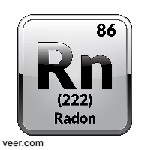

# 改名
从 **“TabGreen”** 改名为 **“IsTarrie”** 作为我的新英文名(包括GitHub用户名在内的所有名称都要变更)
# 域名
计划注册
[istarrie.site](https://istarrie.site)
作为个人blog的主域名
# 我的标志性颜色

我的标性颜色是:**`#967AD4`**

这是我领养的像素点:
https://像素点.cn/967AD4
# 我的元素

一个被我看中的元素:

为什么看上它?因为:
- 它是非人造元素中唯一具有放射性的气体元素
- 它是稀有气体(最后一位 非人造气体)

为什么加入这个板块?当然是找乐子,不然还能干嘛.

# 开发计划
- 上学的日子 ***(除了寒暑假的日子)***

    就搞一些小项目,比如canvas艺术,或者是给我的网站做一个新的页面

    **暑假计划制作一个[hexo](https://hexo.io)主题**
    **(但是因为学校该死的暑假班  (还他妈几乎是强制性的,暑假里上的新课开学后他妈的不补)  ,被迫减少构建时间)**
- 放假的日子 ***(寒暑假)***

    - 在[TETR.IO](https://tetr.io)上打 俄罗斯方块
    - 大项目……?
# 关于我的GitHub账号
只发布**艺术品**和**有用**的项目
# 关于我的CodePen账号
**[https://codepen.io/IsTarrie/](https://codepen.io/IsTarrie/)**

只发布**在GitHub上**完成调试的**艺术品**
