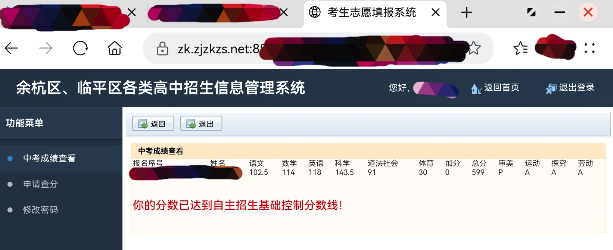
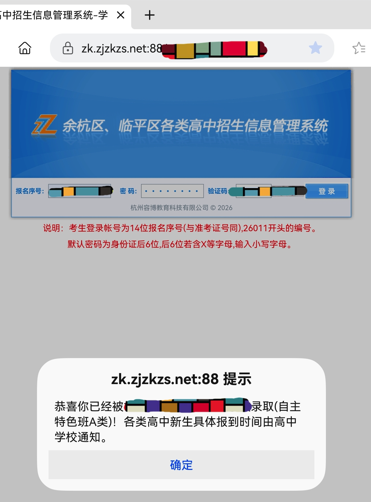

# 回归
中考已经结束，**我回归了**。但是这个暑假我很忙。要预习高中新课。当然时间还是有的。
# 高中
中考考的 **特别特别差** ,尤其是科学 **考低了至少10分** ,但是幸好自主招生过了,没有炸飞.不然我就真废了.

# 域名
计划注册
[istarrie.site](https://istarrie.site)
作为个人blog的主域名
# 我的标志性颜色

我的标性颜色是:**`#967AD4`**

这是我领养的像素点:
https://像素点.cn/967AD4

# 开发计划
- 上学的日子 ***(除了寒暑假的日子)***

    就搞一些小项目,比如canvas艺术,或者是给我的网站做一个新的页面

    **正在维护一个极简[astro](https://astro.build)主题[PaperTheme](https://github.com/IsTarrie/PaperTheme/)**
   
- 放假的日子 ***(寒暑假)***

    - 在[TETR.IO](https://tetr.io)上打 俄罗斯方块
    - 大项目……?
# 关于我的GitHub账号
只发布**艺术品**和**有用**的项目
# 关于我的CodePen账号
**[https://codepen.io/IsTarrie/](https://codepen.io/IsTarrie/)**

只发布**在GitHub上**完成调试的**艺术品**

# 联系到我
邮箱:[istarrie@163.com](mailto:istarrie@163.com)
B站:[番茄黄瓜味薯片](https://space.bilibili.com/3493280864013042)
